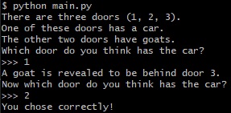
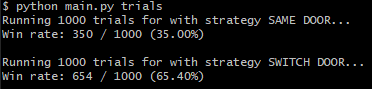

# Monty Hall Problem
A small Python implementation of the [Monty Hall problem](https://en.wikipedia.org/wiki/Monty_Hall_problem).

Play a single game by running the script without any command line arguments.

Running the script with command line arguments will simulate 1000 games with and without swapping doors.

